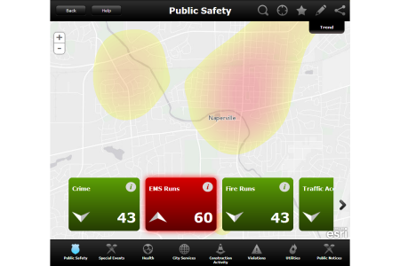
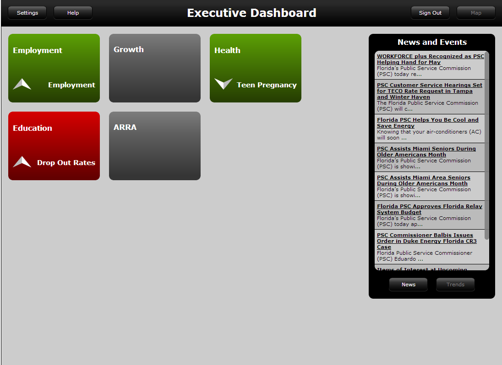

# executive-dashboard (Mature Support)

***This executive dashboard repo has been moved to the [Mature Support Lifecycle Phase](http://links.esri.com/Support/ProductLifeCycle), applications built from this repo are in the Mature Support lifecycle phase.***

The Executive Dashboard is a configuration of ArcGIS and JavaScript application used by government leaders to proactively view critical metrics, identify trends, raise questions, and devise new management strategies.  It supports community-wide efforts to increase accountability and transparency within government and with the citizens they serve.   The Dashboard is a single application that can be deployed by  governments and used by decision-makers on a tablet device and desktop PC.

[Try the Executive Dashboard for State Government application](http://links.esri.com/stategovernment/tryit/StateDashboard/)

[Try the Executive Dashboard for Local Government application](http://links.esri.com/localgovernment/tryit/ExecutiveDashboard/)

## Features

* Review key performance indicators
* Identify concentrations of activities
* Review trends
* Share concerns and collaborate with other decision makers in organization

## Requirements

**Start now using Esri-supplied sample services**

You can start using the application now by setting it up on a web server running Microsoft Internet Information Services (IIS) and using sample services supplied by Esri.
You'll need to convert to an application in IIS and use the ASP .NET 4.0. application pool.

**Start now using your own services**

For more information on requirements and publication steps, see [State Executive Dashboard](http://links.esri.com/stategovernment/help/10.2/ExecutiveDashboard) or [Executive Dashboard](http://links.esri.com/localgovernment/help/10.2/ExecutiveDashboard) help.

### Developer Notes

Of interest to the developer is the configuration of the proxy for RSS
feeds. If you configure the proxy to require URLs to match those present in the proxy.config file
as [recommended by Esri](http://help.arcgis.com/en/webapi/javascript/arcgis/help/jshelp_start.htm#jshelp/ags_proxy.htm),
you limit your users to whatever RSS feed URLs are configured. If instead you change mustMatch to
"false", you permit your users to select any RSS feed, but there is the possibility that the site
might be used by unexpected sources. This is a security tradeoff that you and your organization must
decide.

## Resources

Additional [information and sample data](http://www.arcgis.com/home/item.html?id=3cb2ddb370be4b4aa76a03f39ab69b3a) are available for the application.

Learn more about Esri's [ArcGIS for Local Government maps and apps](http://solutions.arcgis.com/local-government/).

Learn more about Esri's [ArcGIS for State Government maps and apps](http://solutions.arcgis.com/state-government/).

Show me a list of other [State and Local Government GitHub repositories](http://esri.github.io/#Government).

This application uses the 3.11 version of [Esri's ArcGIS API for JavaScript](http://help.arcgis.com/en/webapi/javascript/arcgis/); see the site for concepts, samples, and a reference for using the API to create mapping web sites.

[New to Github? Get started here.](http://htmlpreview.github.com/?https://github.com/Esri/esri.github.com/blob/master/help/esri-getting-to-know-github.html)

## Issues

Find a bug or want to request a new feature?  Please let us know by submitting an issue.

## Contributing

Esri welcomes contributions from anyone and everyone.
Please see our [guidelines for contributing](https://github.com/esri/contributing).

## Licensing

Copyright 2013 Esri

Licensed under the Apache License, Version 2.0 (the "License");
you may not use this file except in compliance with the License.
You may obtain a copy of the License at

   http://www.apache.org/licenses/LICENSE-2.0

Unless required by applicable law or agreed to in writing, software
distributed under the License is distributed on an "AS IS" BASIS,
WITHOUT WARRANTIES OR CONDITIONS OF ANY KIND, either express or implied.
See the License for the specific language governing permissions and
limitations under the License.

A copy of the license is available in the repository's
[LICENSE.txt](LICENSE.txt) file.

